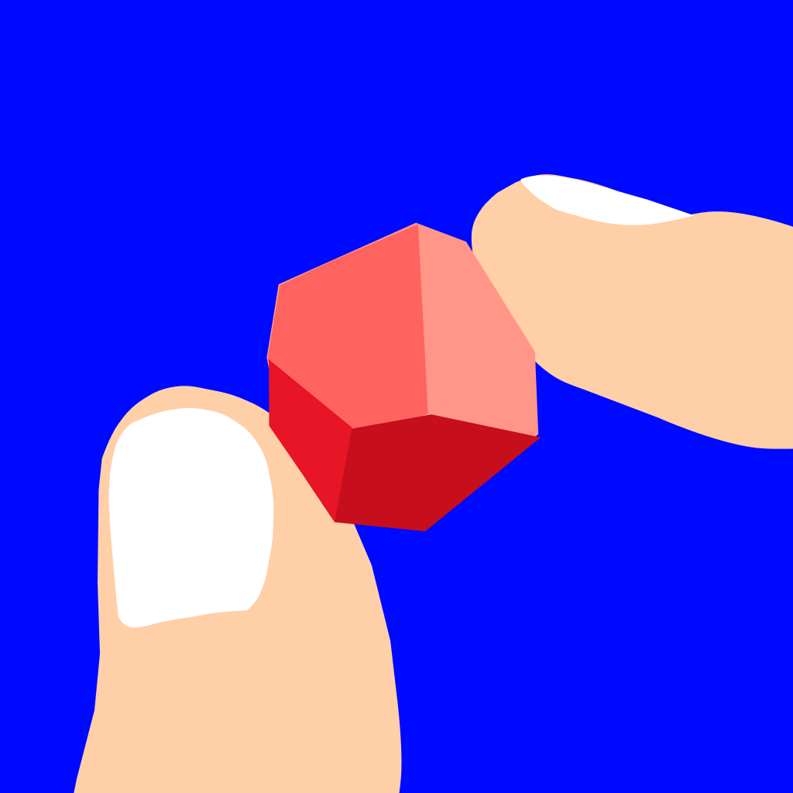

<p align="center">
  
</p>
<h1 align="center">Golonil</h1>
<p align="center">
  
  
  
  
</p>
<p align="center">
  A digital companion app for the ancient Persian game <b>Gol ya Pooch (گل یا پوچ)</b> - 
  bringing traditional card gaming to the modern era through beautiful design and intuitive gameplay.
</p>

---

<p align="center">
  
</p>

<p align="center">
  <a href="YOUR_YOUTUBE_URL">
    
  </a>
  <a href="YOUR_APPSTORE_URL">
    
  </a>
</p>

---

## 📖 Description

**Golonil** modernizes the timeless Persian game of "Gol ya Pooch" - a strategic card game of tricking and guessing that has brought families and friends together for generations. This app serves as your digital game companion, managing the card mechanics, timing, and game flow while preserving the social interaction that makes the game special.

Perfect for family gatherings, game nights, or introducing friends to Persian culture, Golonil combines authentic gameplay with stunning Persian-inspired artwork and a seamless mobile experience.

**"I bet you CAN'T find it"** - Challenge your friends to this ancient game of strategy!

## ✨ Features

- **🎴 Authentic Persian Card Designs** - Beautiful original artwork featuring traditional patterns, Persian characters, and thematic illustrations
- **📱 Mobile-Optimized Interface** - Smooth, touch-friendly gameplay designed specifically for iOS devices
- **🎯 Interactive Card Selection** - Tap to reveal and choose your cards with real-time feedback
- **🎲 Complete Game Management** - Automated card dealing, round timing, and game flow
- **📚 Built-in Tutorials** - Learn traditional Gol ya Pooch rules through interactive guides
- **⚙️ Customizable Settings** - Adjust game parameters, timers, and rules to match your play style
- **🎨 Immersive Persian Aesthetic** - Warm parchment backgrounds with traditional design elements
- **⏱️ Round Timer System** - Keep games moving at the perfect pace

## 🛠️ Technology

- **Swift** - Native iOS development
- **SwiftUI** - Modern declarative UI framework
- **SpriteKit** - Smooth card animations and game interactions
- **Metal** - Hardware-accelerated graphics rendering
- **AudioToolbox** - Sound effects and audio feedback
- **iOS 17+** - Latest iOS features and optimizations

## 🎮 How to Play

### Getting Started
1. Launch Golonil and tap **"New Game"**
2. Set up your teams and configure game settings
3. New to the game? Check out the **Tutorials** section

### Card Selection Phase
Each team takes turns selecting their cards:
- Tap face-down cards to reveal them
- Choose 5 cards for your hand
- Selected cards appear at the bottom (track progress: "Selected: X/5")
- Strategize based on the cards available

### About Gol ya Pooch
An ancient Persian card game combining bluffing, memory, and strategy. Players must outwit opponents through clever plays and deduction. The name translates to "Flower or Empty" - representing the core trick-taking mechanic.

### Special Cards
- **The Spy** - Gather strategic information
- **Two Birds, One Stone** - Efficient combination plays
- **Nothing to Lose** - High-risk, high-reward moves
- **Empty Replay** - Get another chance
- **Duel** - Direct confrontation between players

## 🚀 Installation

### Prerequisites
- macOS with Xcode 15+
- iOS 17+ device or simulator
- Apple Developer account (for device testing)

### Setup

```bash
# Clone the repository
git clone https://github.com/yourusername/golonil.git
cd golonil

# Open in Xcode
open Golonil.xcodeproj

# Or if using Swift Package Manager
open Package.swift
```

### Running the App

1. Open the project in Xcode
2. Select your target device or simulator
3. Press `Cmd + R` to build and run
4. For device testing, configure your signing team in project settings

## 📱 Screenshots

<p align="center">
  
  
  
</p>


## 🙏 Acknowledgments

- Inspired by the ancient Persian game Gol ya Pooch (گل یا پوچ)
- Card artwork inspired by traditional Persian carpets and miniature paintings
- Built to preserve and share Persian cultural heritage
- Thanks to all families keeping traditional games alive

---

<p align="center">
  <i>"Play and Learn the fun and competitive game of Golonil"</i><br>
</p>
